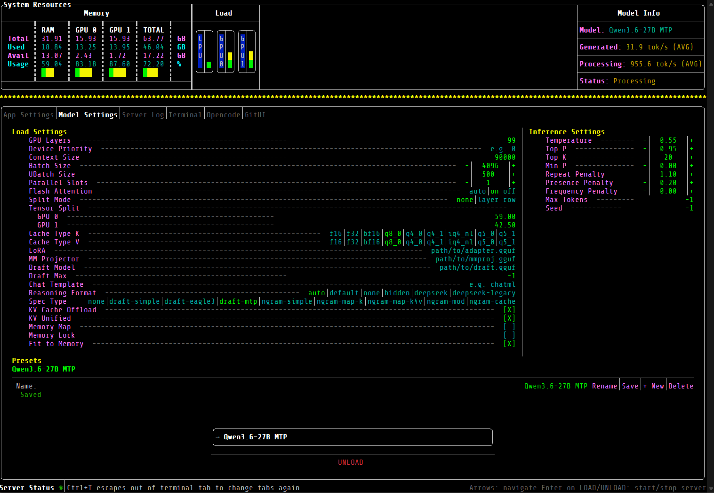

# Workbench (WIP)

[](https://github.com/enisbukalo/Workbench/actions/workflows/build.yml)
[](https://github.com/enisbukalo/Workbench/actions/workflows/pr-tests.yml)
[](https://github.com/enisbukalo/Workbench/releases/latest)
[](LICENSE)
[](https://en.cppreference.com/w/cpp/20)
[](https://cmake.org/)
[](#building)
[](https://github.com/enisbukalo/Workbench/stargazers)

A keyboard-driven **TUI frontend for [llama.cpp](https://github.com/ggml-org/llama.cpp)**. Workbench launches and supervises a `llama-server` process, monitors your system (CPU / GPU / RAM), discovers and loads GGUF models, embeds a real terminal, and persists everything to JSON — all from one terminal interface.

Built with [FTXUI](https://github.com/ArthurSonzogni/ftxui), [spdlog](https://github.com/gabime/spdlog), [nlohmann/json](https://github.com/nlohmann/json), [cpp-httplib](https://github.com/yhirose/cpp-httplib), [libvterm](https://www.leonerd.org.uk/code/libvterm/), and [GoogleTest](https://github.com/google/googletest).

[](https://github.com/ArthurSonzogni/ftxui)
[](https://github.com/ggml-org/llama.cpp)
[](https://www.docker.com/)



## Features

- **Live system monitoring** — CPU, GPU (NVIDIA via `nvidia-smi`), and RAM gauges, refreshed on a configurable interval.
- **Server control** — start/stop `llama-server`, view its health and streamed stdout/stderr logs.
- **Model management** — discover `.gguf` files on disk, browse `models.ini` presets, and load/unload models over the server's HTTP API.
- **Loaded-model info** — name, size, context length, and quantization of the active model.
- **Embedded terminal** — a real PTY-backed shell (libvterm) with savable presets.
- **Settings UI** — server, UI, and terminal options edited in-app and saved to JSON.
- **Theming** — JSON theme files loaded at startup (see the [wiki](../../wiki)).

## Requirements

- **Docker**, or a native Linux toolchain with CMake 3.25+, a C++20 compiler, Make,
  `clang-format`, and MinGW when cross-compiling Windows.
- A **`llama-server`** binary on the host you run Workbench on (path is configurable).
- **NVIDIA drivers + `nvidia-smi`** on `PATH` — optional, required only for live GPU monitoring.

## Building

Builds can run inside Docker or directly on Linux after installing the native toolchain.

On Debian/Ubuntu, install the native dependencies with:

```bash
sudo apt install build-essential cmake git clang-format \
  mingw-w64-x86-64-dev g++-mingw-w64-x86-64-posix
```

### Linux (default)

```bash
docker-compose run --rm cpp-app ./build.sh
# Native Linux
./build.sh
```

### Windows (cross-compile)

```bash
docker-compose run --rm cpp-app ./build.sh --windows
# Native Linux cross-compile
./build.sh --windows
```

### Both Linux and Windows

```bash
docker-compose run --rm cpp-app ./build.sh --all
# Native Linux
./build.sh --all
```

### Clean build

Add `--clean` (or `-c`) to delete build directories before building:

```bash
docker-compose run --rm cpp-app ./build.sh --clean --all
```

### Build tests and coverage for Linux

```bash
docker-compose run --rm cpp-app ./build.sh --test
# Native Linux
./build.sh --test
```

### Options

| Flag | Short | Description |
|------|-------|-------------|
| `--clean` | `-c` | Delete build directories before building |
| `--windows` | `-w` | Cross-compile for Windows |
| `--all` | `-a` | Build for both Linux and Windows |
| `--test` | `-t` | Builds tests and coverage in Linux |
| `--help` | | Show usage information |

## Running

After a Linux build, the binary is at `build_linux/Workbench`. On first run Workbench
creates its config directory and a default `config.json`:

- **Linux / macOS:** `~/.workbench/`
- **Windows:** `%USERPROFILE%\.workbench\`

That directory holds `config.json`, `logs/`, `models.ini`, and `themes/`. See the
[Configuration wiki page](../../wiki/Configuration) for the full layout.

## Testing

```bash
docker-compose run --rm cpp-app ./build.sh --test
```

This builds with `BUILD_TESTS=ON`, runs the GTest/GMock suite (`build_linux/WorkbenchTests`), and generates a coverage report.

## Documentation

- **[Project Wiki](../../wiki)** — architecture, building, configuration, panels, monitoring, server management, theming, and contributing guides.
- **[docs/arch.md](docs/arch.md)** — full architecture and design reference.
- **API docs** — run `doxygen Doxyfile` to generate browsable HTML from the in-source Doxygen comments (output in `docs/api/`).

## Versioning

Workbench follows [Semantic Versioning](https://semver.org/) with pre-1.0 semantics
(`0.MINOR.PATCH`):

- **MINOR** (`0.4.x` → `0.5.0`) — new features, or breaking changes to config/behavior.
- **PATCH** (`0.4.0` → `0.4.1`) — bug fixes only, no new functionality.

Releases are cut by pushing an annotated tag matching `v*`:

```bash
git tag -a v0.5.0 -m "Workbench v0.5.0"
git push origin v0.5.0
```

The [Release workflow](.github/workflows/release.yml) then builds the Linux and Windows
binaries in Docker, packages them as `Workbench-linux.zip` / `Workbench-windows.zip`, and
publishes a GitHub release with generated notes.

## Tech Stack

| Library | Version | Purpose |
|---|---|---|
| FTXUI | v7.0.1 | TUI rendering + event loop |
| spdlog | v1.12.0 | Logging |
| nlohmann/json | bundled | JSON config (de)serialization |
| cpp-httplib | bundled | HTTP client for the llama-server API |
| libvterm | 0.3.3 | VT100 terminal emulation |
| GoogleTest | v1.14.0 | Unit testing + mocking |

Language standard: **C++20**. CMake **3.25+**.
